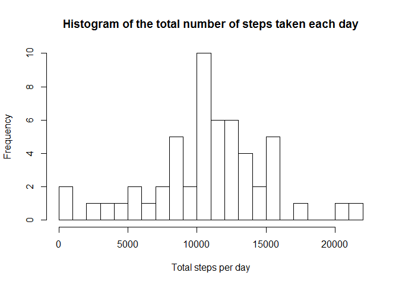
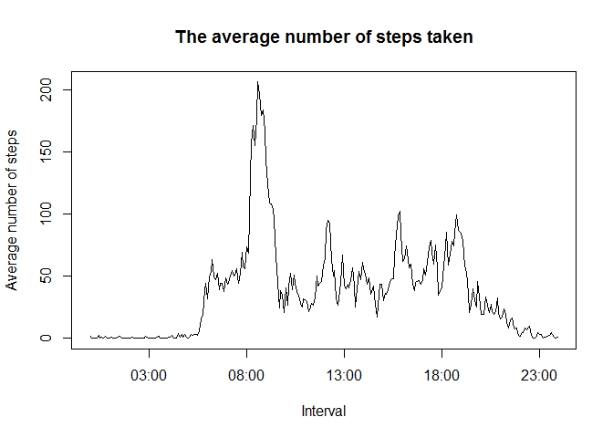
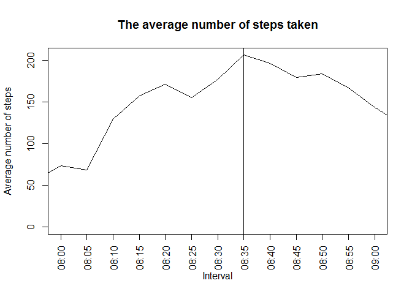
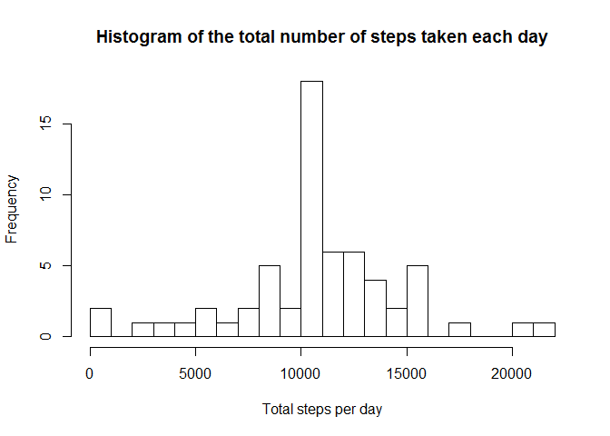

# Reproducible Research: Course Project 1
Yuriy Kotselko  
9 June 2017  


## Loading and preprocessing the data

Let's assume that source "activity.csv" is already located in Working directory. The following chunk of code will try to load the data into "activity" varibale and if activity.csv does not exist it will throw an error.


```r
if (!file.exists("activity.csv")) {
    stop("activity.csv not found in working directory.")
}

activity <- read.csv("activity.csv",header = TRUE,sep = ",", na.strings = "NA")
head(activity,5)
```

```
##   steps       date interval
## 1    NA 2012-10-01        0
## 2    NA 2012-10-01        5
## 3    NA 2012-10-01       10
## 4    NA 2012-10-01       15
## 5    NA 2012-10-01       20
```

```r
str(activity)
```

```
## 'data.frame':	17568 obs. of  3 variables:
##  $ steps   : int  NA NA NA NA NA NA NA NA NA NA ...
##  $ date    : Factor w/ 61 levels "2012-10-01","2012-10-02",..: 1 1 1 1 1 1 1 1 1 1 ...
##  $ interval: int  0 5 10 15 20 25 30 35 40 45 ...
```

As we can see from the output of head command, the "activity" datadset consists of three columns:
- steps: Number of steps taking in a 5-minute interval
- date: The date on which the measurement was taken in YYYY-MM-DD format
- interval: Identifier for the 5-minute interval in which measurement was taken

date is a Factor variable and interval is an integer. It would be a good idea to convert it to proper DateTime variable. Let's add one more column datetime containing POSIX date combining date and interval together:


```r
library(stringr)
library(lubridate)

activity$datetime <- parse_date_time(paste(activity$date, str_pad(activity$interval,4,pad = "0")),"%Y-%m-%d %H%M")
head(activity,5)
```

```
##   steps       date interval            datetime
## 1    NA 2012-10-01        0 2012-10-01 00:00:00
## 2    NA 2012-10-01        5 2012-10-01 00:05:00
## 3    NA 2012-10-01       10 2012-10-01 00:10:00
## 4    NA 2012-10-01       15 2012-10-01 00:15:00
## 5    NA 2012-10-01       20 2012-10-01 00:20:00
```


## What is mean total number of steps taken per day?
Let's calculate the total number of steps taken per day. We use functions group_by and summarize from dplyr package to do that:

```r
library(dplyr)
group_by_date <- group_by(activity,date)
steps_by_day <- summarize(group_by_date, total = sum(steps))
summary(steps_by_day)
```

```
##          date        total      
##  2012-10-01: 1   Min.   :   41  
##  2012-10-02: 1   1st Qu.: 8841  
##  2012-10-03: 1   Median :10765  
##  2012-10-04: 1   Mean   :10766  
##  2012-10-05: 1   3rd Qu.:13294  
##  2012-10-06: 1   Max.   :21194  
##  (Other)   :55   NA's   :8
```

Let's plot the histogram of the total number of steps taken each day. Parameter breaks = 20 should provide us more clear picture.


```r
hist(steps_by_day$total, breaks=20, main="Histogram of the total number of steps taken each day", xlab="Total steps per day")
```

<!-- -->

From the histogram we can see that we have more days with 10 up to 11 thousand steps per each. When we calculate we calculate mean and median we will see the proof:

```r
mean(steps_by_day$total, na.rm = TRUE)
```

```
## [1] 10766.19
```

```r
median(steps_by_day$total, na.rm = TRUE)
```

```
## [1] 10765
```
As wee can see, mean and median show us values between 10000 and 11000. That what we were able to see on the histogram plot.

##What is the average daily activity pattern?
In order to figure it out, we need to calculate the average number of steps taken, averaged across all days. WE use dplyr package to group data:

```r
group_interval <- group_by(activity,interval)
average_by_day <- summarize(group_interval, average = mean(steps,na.rm = TRUE))
with(average_by_day, 
    plot(
        strptime(str_pad(interval,4,pad = "0"),format = "%H%M"), 
        average, type = "l", 
        main="The average number of steps taken", ylab="Average number of steps", xlab="Interval")
)
```

<!-- -->
From the plot we can see that the maximum number of steps is lying between 8:00 and 9:00 am. In order to find out the 5 minutes interval containing the maximum number of steps let's limuit the plot by x:

```r
group_interval <- group_by(activity,interval)
average_by_day <- summarize(group_interval, average = mean(steps,na.rm = TRUE))
intervalLabels <- strptime(str_pad(average_by_day[average_by_day$interval >= 800 & average_by_day$interval <= 900,]$interval,4,pad = "0"),format = "%H%M")
with(average_by_day,
    plot(
        strptime(str_pad(interval,4,pad = "0"),format = "%H%M"), 
        average, type = "l", 
        main="The average number of steps taken", ylab="Average number of steps", xlab="Interval", 
        xlim = c(as.POSIXct('08:00',format = "%H:%M"),as.POSIXct('09:00',format = "%H:%M")))
   
)
 axis.POSIXct(1, at = intervalLabels, las = 2, labels = format(intervalLabels, format = "%H:%M"))
 abline(v = as.POSIXct('08:35',format = "%H:%M"))
```

<!-- -->

Let's check in in another way:

```r
average_by_day[which.max(average_by_day$average), ]
```

```
## # A tibble: 1 × 2
##   interval  average
##      <int>    <dbl>
## 1      835 206.1698
```
Really, 8:35 is the interval, containing the maximum number of steps.

##Imputing missing values
1. In order alculate the number of missing values wwe can use complete.cases function:

```r
table(complete.cases(activity))
```

```
## 
## FALSE  TRUE 
##  2304 15264
```

From the input above we can see that we have 2304 rows with NA

2. In order to impute the missing data we can use average_by_day dataset obtained in previous calculations containing average number of steps taken, averaged across all days. Let's fill the missing data. The algorythm is the following:
- split activities data set in ot two sets: activity_real containing real data and activity_NA containing NA rows.
- merge activity_NA with average_by_day by interval, reorder columns and rows, rename column names into activity_imputed dataset
- rbind activity_real and activity_imputed into new dataset activity_full


```r
dim(activity)
```

```
## [1] 17568     4
```

```r
activity_not_NA <- complete.cases(activity)
activity_real <- activity[activity_not_NA,]
activity_NA <- activity[!activity_not_NA,]
activity_imputed <- merge(activity_NA, average_by_day, by = "interval")
activity_imputed <- activity_imputed[,c(5,3,1,4)]
activity_imputed <- activity_imputed[order(activity_imputed[,2], activity_imputed[,3]), ]
names(activity_imputed) <- names(activity)
activity_full <- rbind(activity_imputed, activity_real)
activity_full <- activity_full[order(activity_full[,2], activity_full[,3]), ]
dim(activity_full)
```

```
## [1] 17568     4
```

```r
head(activity_full,5)
```

```
##        steps       date interval            datetime
## 1  1.7169811 2012-10-01        0 2012-10-01 00:00:00
## 10 0.3396226 2012-10-01        5 2012-10-01 00:05:00
## 17 0.1320755 2012-10-01       10 2012-10-01 00:10:00
## 29 0.1509434 2012-10-01       15 2012-10-01 00:15:00
## 33 0.0754717 2012-10-01       20 2012-10-01 00:20:00
```

Now we have a new dataset activity_full that is equal to original dataset activity (the same dimensions) but with missing data filled in.

Let's make a histogram again and calculate the mean and median:


```r
group_by_date1 <- group_by(activity_full,date)
steps_by_day1 <- summarize(group_by_date1, total = sum(steps))

hist(steps_by_day1$total, breaks=20, main="Histogram of the total number of steps taken each day", xlab="Total steps per day")
```

<!-- -->

```r
mean(steps_by_day1$total, na.rm = TRUE)
```

```
## [1] 10766.19
```

```r
median(steps_by_day1$total, na.rm = TRUE)
```

```
## [1] 10766.19
```

Hm. The histogram looks almost identical but we have more strong pattern between 10000 and 11000. And median and mean are now equal. So, it seems to be that imputing missing data has a positive impact in estimating of the total daily number of steps.

##Are there differences in activity patterns between weekdays and weekends?
Let's create a new factor variable with two levels: weekday and weekend. Also we have to group the data again:


```r
activity_full$isWeekend <- as.factor(ifelse(weekdays(activity_full$datetime) %in% c("Saturday","Sunday"), "weekend", "weekday"))

group_interval <- group_by(activity_full,interval, isWeekend)
average_by_day <- summarize(group_interval, average = mean(steps,na.rm = TRUE))

library(lattice)
xyplot( average ~ interval | isWeekend,data = average_by_day, type = 'l', layout = c(1,2), ylab="Number of steps", xlab="Interval")
```

<!-- -->
